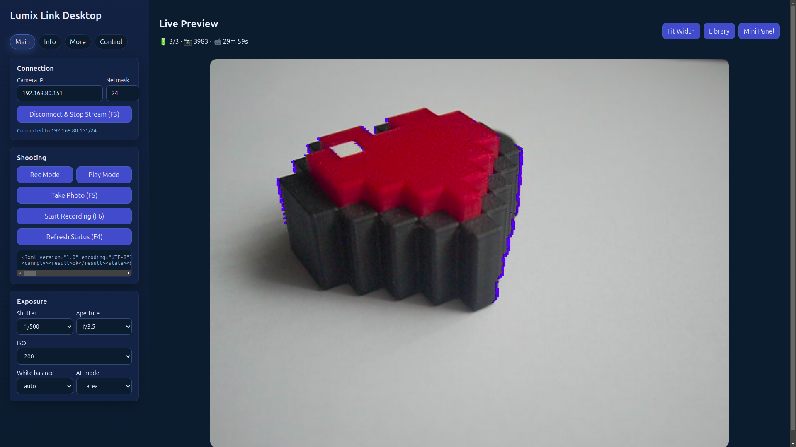
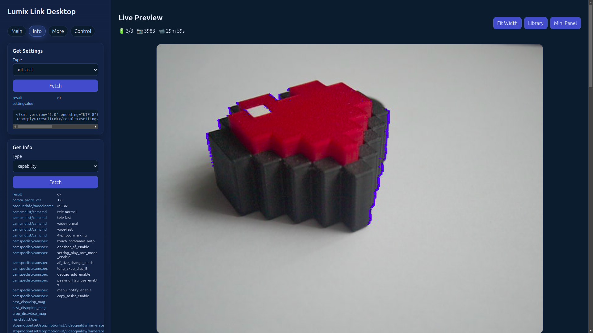
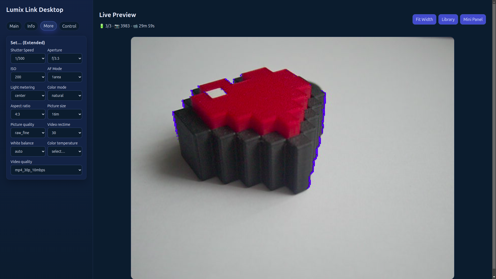
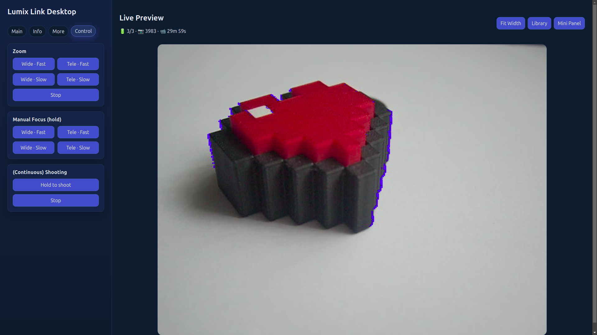
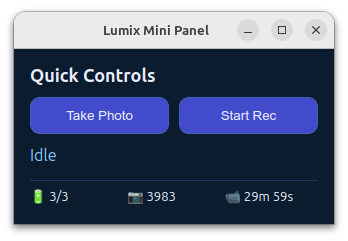
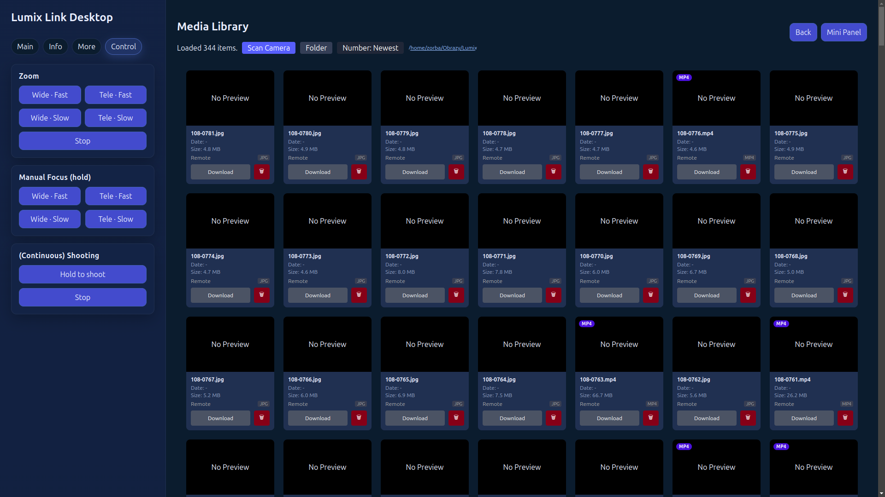
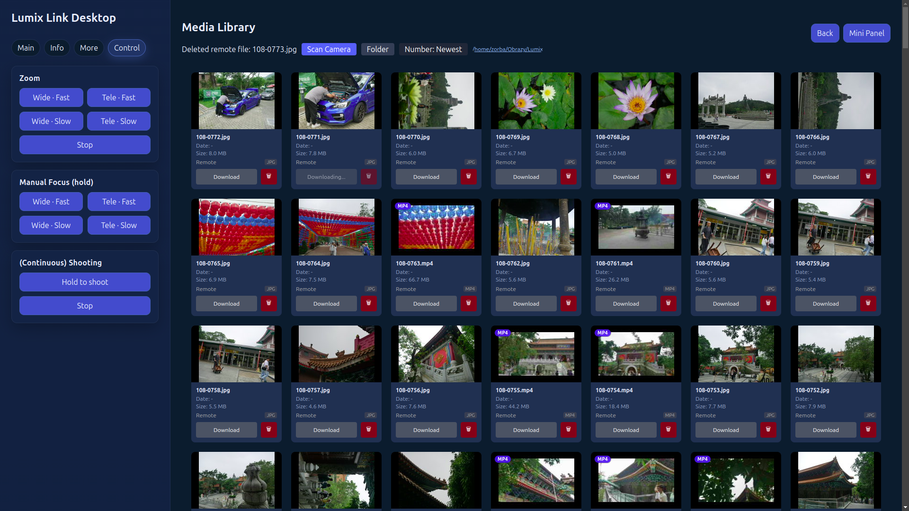
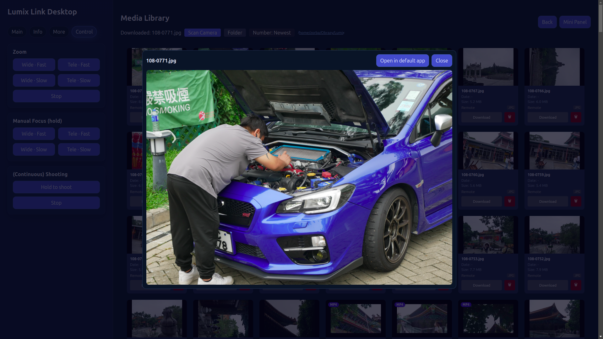

# Lumix Link Desktop

A desktop application for controlling and monitoring Panasonic Lumix cameras over Wi-Fi. This project is a fork and extension of the original [Lumix Link](https://github.com/peci1/lumix-link-desktop) work, adding new features, improvements, and a rebuilt desktop shell using Electron.

Built with **Electron + React + Vite + TypeScript**.


NOTE: Mostly vibe-coded :), please bear that in mind.

---

## Features

### 1. Main window — connection & live view
Connect to the camera over Wi-Fi, trigger basic actions (shutter, burst, video), and see a live viewfinder stream directly in the app.



### 2. Camera info & extended options
Display additional information exposed by the camera firmware — battery level, remaining shots, current mode, and more.



### 3. Exposure, shutter speed & white balance
Fine-tune the main shooting parameters: aperture (F-stop), shutter speed, ISO, and white balance — all without touching the camera.



### 4. Zoom / focus control & burst panel
Precise zoom and focus control via on-screen sliders, plus a quick-access panel for triggering burst / interval sequences.



### 5. Floating mini-window (overlay mode)
A compact always-on-top tool window giving instant access to the most-used actions. Perfect for overlaying on top of another application such as OBS Studio during streaming or recording.



### 6. Media library — scanning
Browse the images stored on the camera's SD card. Initiate a library scan to index all available files.



### 7. Media library — loaded
View thumbnails of all scanned images. Download selected photos to a local folder, remove files locally or directly from the camera.



### 8. Full-resolution image preview
Open a downloaded photo in high resolution inside the app, then quickly open the containing folder or launch the image in the system default viewer.



---

## Requirements

- Node.js ≥ 18
- npm ≥ 9
- Panasonic Lumix camera with Wi-Fi / the Lumix Sync protocol enabled

---

## Development

Install dependencies and start the dev server (Electron + Vite hot-reload):

```bash
npm install
npm run dev
```

---

## Building

Build the renderer and Electron main process, then package for Linux and Windows:

```bash
npm run dist
```

Output is placed in the `release/` directory.

---

## Pre-built installers

Ready-to-use packages are available in the `release/` directory after a build (or from the releases page):

| Platform | File | Notes |
|----------|------|-------|
| Linux | `Lumix Link Desktop-x.y.z.AppImage` | Run directly, no installation needed |
| Linux | `lumix-link-desktop_x.y.z_amd64.deb` | Debian/Ubuntu package |
| Windows | `Lumix Link Desktop Setup x.y.z.exe` | NSIS installer |

**Running the AppImage:**

```bash
chmod +x "Lumix Link Desktop-2.0.0.AppImage"
./"Lumix Link Desktop-2.0.0.AppImage"
```

NOTE: If running under ubuntu linux it AppImage might be run with `--no-sandbox` option

---

## License

See [LICENSE.md](LICENSE.md).
